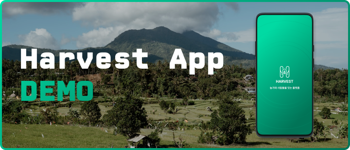

    
    

    
    
    

    <h3>Harvest App Demo</h3>
    
RN + Expo를 활용한 android & ios 앱 만들기

## 📑 <a name="table">Table of Contents</a>

1. 👁️‍🗨️ [Outlook](#outlook)

2. 🧠 [Prerequisite](#-prerequisite)

3. 🖥️ [TechStack](#️-tech-stack)

## 👁️‍🗨️️ <a name="outlook">Outlook</a>

하베스트 프로젝트가 성공적으로 진행되길 바랍니다. 개발 속도가 느려지는 것을 우려해 따라 만들 수 있는 틀을 제공해 드리겠습니다.

필요에 따라 수정하여 사용하셔도 좋고, 본 프로젝트를 토대로 본인만의 프로젝트를 시작하셔도 좋습니다. 필자 또한 웹 개발자이므로 앱 개발에 능숙하지 않지만, 웹 개발 지식들을 최대한 재활용하는 형태로 프로젝트를 구성하고자 노력했습니다.

## 🧠 <a name="prerequisite">Prerequisite</a>

웹 개발 지식을 베이스로 가지고 있는 개발자를 위한 프로젝트입니다.

제일 기본이 되는 사항은 자바스크립트와 타입스크립트 그리고 리액트에 익숙해야 합니다. 또한 Expo Router를 사용하기 때문에 NextJS 버전 14 이상의 `app router` 사용이 익숙하다는 가정하에 프로젝트를 만들었습니다.

### Web Vs App

- App에는 DOM요소가 없습니다. 웹에서 흔히 사용하는 `e.target` 같은 것은 사용할 수 없습니다.

- 웹에서 사용하던 기능들이 100% 똑같이 작동하지 않습니다. 같은 기능인데 이름이 다르거나 필요한 파라미터들이 다릅니다. 예상과 다른 동작들이 존재할 때 공식문서를 참고해 주세요.

#### ex.

|     React(Web)     | React(React-Native) |
| :----------------: | :-----------------: |
|      `
`      |      `<View/>`      |
| `<h1~6/>, 
...` |      `<Text/>`      |
|     `onClick`      |      `onPress`      |

### Demo Server

실제 데이터 패칭 과정을 경험할 수 있도록 하려면 서버를 실행시키고 프로젝트를 구동하세요.

## 🖥️ <a name="tech-stack">Tech Stack</a>

- OS: Mac
- UI : React Native, Expo
- Styling: NativeWind(Tailwind CSS)
- State Management & Data Fetching: zustand, Tanstack Query
- Animation : Reanimated
- Demo Server: Axum(rust)

### Edit Log

|    date    |   description   |
| :--------: | :-------------: |
| 2024.08.31 | Initial Setting |
